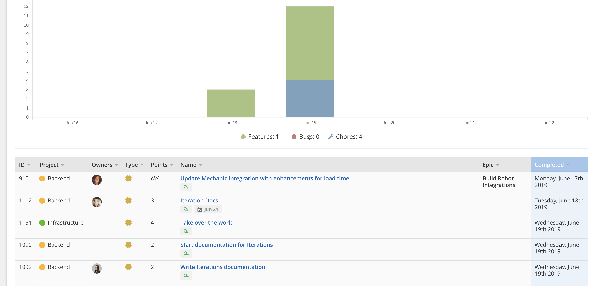

# Clubhouse release notes 📝

## Week ending June 21, 2019
| 👀 | 🚀 |
| :--- | :--- |
|  | More readable velocity chart on Reports page [Internal](https://app.clubhouse.io/internal/story/63843) |

## Week ending June 21, 2019
| 👀 | 🚀 |
| :--- | :--- |
|  | Consistent styling of Epics filters in Stories page sidebar [Internal](https://app.clubhouse.io/internal/story/62583) |
|  | Frontend optimizations on Iteration detail page for more performant real-time updates [Internal](https://app.clubhouse.io/internal/story/62243) |
|  | Navigate to Iteration after creating it [Internal](https://app.clubhouse.io/internal/story/62622) |
|  | Revised Reports page layout for more efficient use of space [Internal](https://app.clubhouse.io/internal/story/63745) |
|  | Headline metrics on Reports page [Internal](https://app.clubhouse.io/internal/story/63915) |
|  | Usability tweaks to date inputs during Iteration creation [Internal](https://app.clubhouse.io/internal/story/61222) |
|   | Consistent ordering of Iterations in Stories page filter and Story dialog dropdown [Internal](https://app.clubhouse.io/internal/story/64101) |

## Week ending June 14, 2019

| 👀 | 🚀 |
| :--- | :--- |
|  | [Iterations](https://help.clubhouse.io/hc/en-us/articles/360028953452%5D) in public Beta |
|  | [Android app](https://clubhouse.io/blog/clubhouse-for-android) |
|  | New Story density option: Title only [Internal](https://app.clubhouse.io/internal/story/62424) | 
|  | More discoverable OR vs AND in Stories page sidebar [Internal](https://app.clubhouse.io/internal/story/62433)  Quick filters section title [Internal](https://app.clubhouse.io/internal/story/62541) |
|  | Move group by and view controls to the right on Epics page to manage clutter [Internal](https://app.clubhouse.io/internal/story/62355) |

---

Email victor@clubhouse.io, tweet [@victorwuky](https://twitter.com/victorwuky), or join our [Clubhouse Community on Slack](https://clubhouse.io/community/) for questions and feedback.
