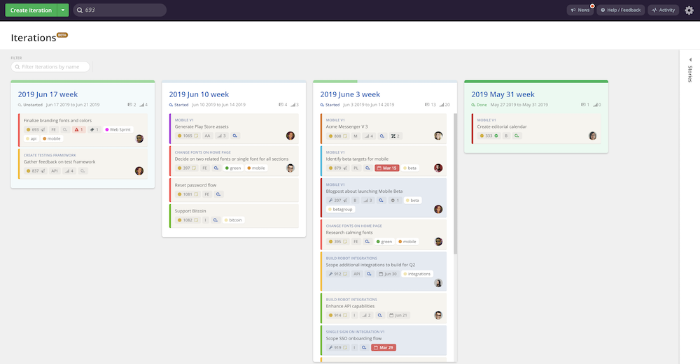

# Clubhouse release notes 📝

## Week ending June 21, 2019
| 🚀 | 👀 |
| :--- | :--- |
| Consistent re-styling of epics filters in stories sidebar |  |
| Frontend optimizations on iterations detail page for more performant real-time updates |  |
| Navigate to iteration after creation |  |

## Week ending June 14, 2019

| 🚀 | 👀 |
| :--- | :--- |
| [Iterations](https://help.clubhouse.io/hc/en-us/articles/360028953452%5D) in public Beta |  |
| [Android app](https://clubhouse.io/blog/clubhouse-for-android) |  |
| New story density option: Title only |  |
| More discoverable OR vs AND in Stories page sidebar  Quick filters section title |  |
| Move group by and view controls to the right on epics page to manage clutter |  |

---

Email victor@clubhouse.io or join the [Clubhouse Community on Slack](https://clubhouse.io/community/) for questions and feedback
